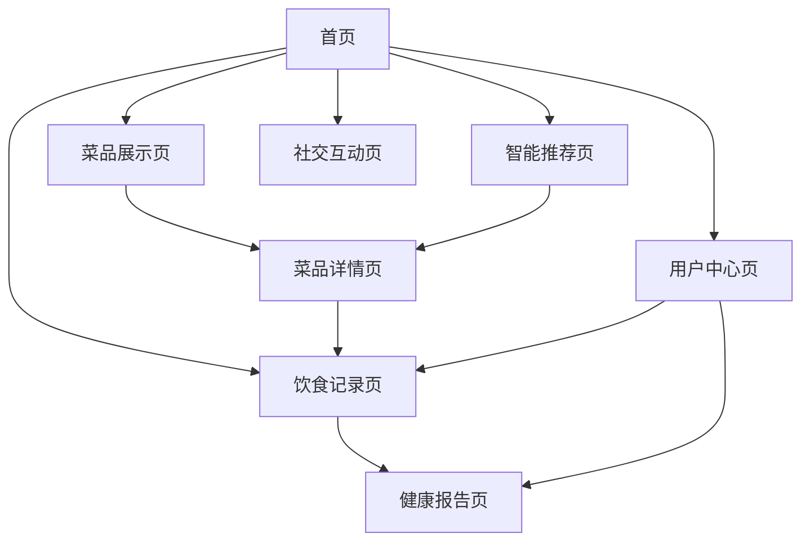

# 电子餐厅网站产品需求文档

## 1. Product Overview
电子餐厅网站是一个集菜品展示、饮食记录、智能推荐和社交互动于一体的综合性健康饮食管理平台。
- 帮助用户科学管理饮食，通过营养分析和个性化推荐实现健康饮食目标，提供社交互动和采购建议等增值服务。
- 目标用户包括注重健康饮食的个人用户、健身爱好者和有特定饮食需求的人群，旨在打造国内领先的智能饮食管理平台。

## 2. Core Features

### 2.1 功能说明
本项目为简化的个人使用项目，无需用户认证系统，所有功能直接开放使用。

### 2.2 Feature Module
我们的电子餐厅网站需求包含以下主要页面：
1. **首页**：导航菜单、热门菜品推荐、搜索功能、用户快速入口
2. **菜品展示页**：菜品列表、分类筛选、排序功能、搜索框
3. **菜品详情页**：菜品信息、营养成分、用户评价、食材清单、采购链接
4. **饮食记录页**：日历视图、每日记录、快速添加、目标设置
5. **智能推荐页**：个性化推荐、季节推荐、目标导向推荐
6. **社交互动页**：用户动态、点赞评论、分享功能
7. **健康报告页**：周/月报告、营养分析、改善建议
8. **用户中心页**：个人信息、目标设置、健康提醒、数据同步

### 2.3 Page Details
| Page Name | Module Name | Feature description |
|-----------|-------------|---------------------|
| 首页 | 导航菜单 | 显示主要功能入口，包括菜品、记录、推荐、社交等模块导航 |
| 首页 | 热门推荐区 | 展示热门菜品卡片，支持轮播切换，点击进入详情页 |
| 首页 | 搜索功能 | 提供全局搜索框，支持菜品名称、分类、营养成分等多维度搜索 |
| 菜品展示页 | 菜品列表 | 卡片式展示菜品，包含图片、名称、评分、热量等基本信息 |
| 菜品展示页 | 分类筛选 | 按菜系、荤素、减脂餐等多维度筛选，支持多选组合 |
| 菜品展示页 | 排序功能 | 支持按热度、评分、热量、价格等多种方式排序 |
| 菜品详情页 | 菜品信息 | 展示高清图片、详细描述、制作工艺等完整信息 |
| 菜品详情页 | 营养成分 | 显示热量、蛋白质、脂肪、碳水化合物等详细营养数据 |
| 菜品详情页 | 用户评价 | 评分系统、文字评价、图片评价，支持点赞和回复 |
| 菜品详情页 | 食材采购 | 列出所需食材清单，提供电商平台购买链接 |
| 饮食记录页 | 日历视图 | 月历形式展示每日饮食记录，点击日期查看详情 |
| 饮食记录页 | 记录管理 | 添加、编辑、删除饮食记录，支持拍照和扫码快速添加 |
| 饮食记录页 | 目标跟踪 | 显示每日营养目标完成情况，提供进度条和数据对比 |
| 智能推荐页 | 个性化推荐 | 基于用户历史和偏好推荐菜品，支持反馈优化 |
| 智能推荐页 | 季节推荐 | 根据时令食材和流行趋势推荐应季菜品 |
| 智能推荐页 | 目标推荐 | 根据用户设定的减脂、增肌等目标推荐适合菜品 |
| 社交互动页 | 动态展示 | 显示其他用户的饮食分享，支持浏览和互动 |
| 社交互动页 | 互动功能 | 点赞、评论、分享到社交平台等社交功能 |
| 健康报告页 | 数据统计 | 生成周/月饮食报告，包含热量、营养成分分析 |
| 健康报告页 | 建议提醒 | 提供个性化的饮食改善建议和健康提醒 |
| 用户中心页 | 个人设置 | 个人信息管理、饮食目标设置、偏好配置 |
| 用户中心页 | 数据同步 | 支持多平台数据同步，云端备份功能 |

## 3. Core Process

**用户使用流程：**
用户直接进入首页浏览热门菜品推荐，通过搜索或分类筛选找到感兴趣的菜品。点击进入菜品详情页查看营养信息和用户评价，决定是否添加到饮食记录。在饮食记录页面，用户可以查看日历形式的历史记录，设置每日营养目标。智能推荐系统会根据用户的饮食习惯和目标提供个性化建议。用户还可以在社交页面查看他人分享，进行互动交流。

## 4. User Interface Design

### 4.1 Design Style
- **主色调**：清新绿色(#4CAF50)作为主色，白色(#FFFFFF)作为背景色，灰色(#757575)作为辅助色
- **按钮样式**：圆角矩形按钮，采用渐变效果和微阴影，悬停时有动画反馈
- **字体**：中文使用苹方/微软雅黑，英文使用Roboto，标题18-24px，正文14-16px
- **布局风格**：卡片式设计，顶部导航栏，左侧可选菜单，响应式网格布局
- **图标风格**：使用线性图标配合实心图标，统一的视觉语言，适当使用食物相关emoji

### 4.2 Page Design Overview
| Page Name | Module Name | UI Elements |
|-----------|-------------|-------------|
| 首页 | 导航菜单 | 顶部固定导航栏，白色背景，绿色高亮当前页面，包含Logo和主要功能入口 |
| 首页 | 热门推荐区 | 大尺寸卡片轮播，每张卡片包含菜品图片、名称、评分星级，自动播放间隔3秒 |
| 菜品展示页 | 菜品列表 | 3列网格布局，每个卡片包含正方形图片、菜品名称、评分、热量标签 |
| 菜品详情页 | 菜品信息 | 大图展示区域，下方为详细信息卡片，营养成分使用进度条可视化 |
| 饮食记录页 | 日历视图 | 月历网格布局，每日显示简化的饮食图标，当前日期高亮显示 |
| 智能推荐页 | 推荐列表 | 垂直卡片列表，每个推荐项包含推荐理由标签和菜品基本信息 |
| 社交互动页 | 动态流 | 时间线布局，每条动态包含用户头像、饮食图片、互动按钮 |
| 健康报告页 | 数据图表 | 使用饼图和柱状图展示营养数据，配色与主题保持一致 |

### 4.3 Responsiveness
网站采用移动优先的响应式设计，在桌面端提供完整功能体验，在移动端优化触摸交互。主要断点设置为768px和1024px，确保在手机、平板和桌面设备上都有良好的用户体验。移动端特别优化了卡片布局和按钮大小，支持手势操作和触摸反馈。