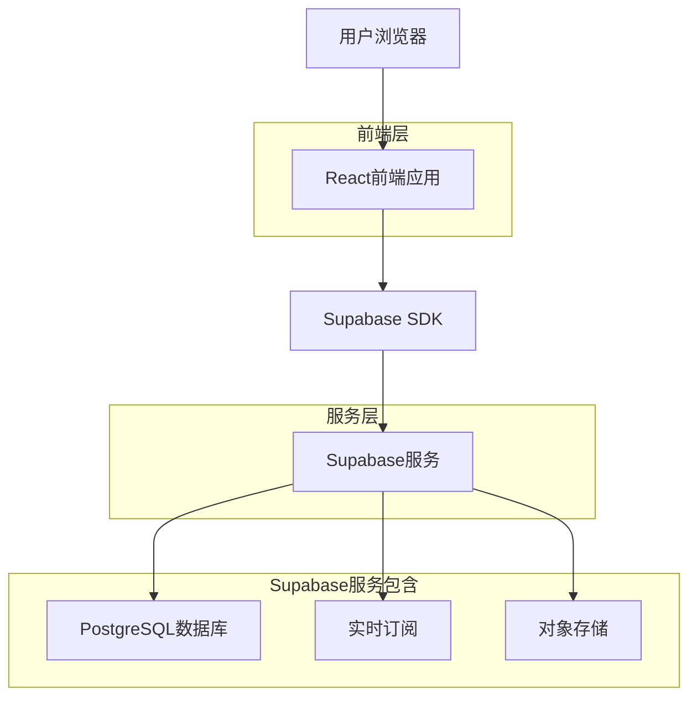
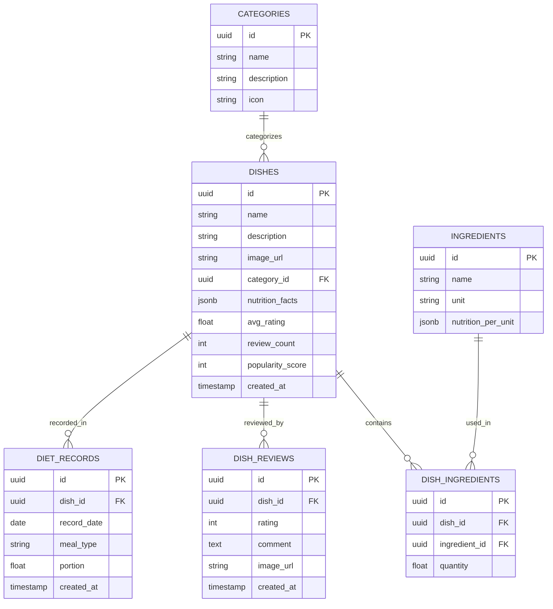

# 电子餐厅网站技术架构文档

## 1. Architecture design



## 2. Technology Description
- Frontend: React@18 + TypeScript + Tailwind CSS@3 + Vite + React Router
- Backend: Supabase (PostgreSQL + Storage + Realtime)
- State Management: Zustand
- UI Components: Headless UI + Heroicons
- Charts: Chart.js
- Image Processing: React Image Crop
- QR Code: qrcode-generator

## 3. Route definitions
| Route | Purpose |
|-------|----------|
| / | 首页，展示热门菜品推荐和主要功能入口 |
| /dishes | 菜品展示页，浏览所有菜品并支持筛选排序 |
| /dishes/:id | 菜品详情页，查看具体菜品信息和营养成分 |
| /records | 饮食记录页，日历形式管理个人饮食记录 |
| /recommendations | 智能推荐页，个性化菜品推荐 |
| /social | 社交互动页，查看他人分享和互动 |
| /reports | 健康报告页，查看饮食分析报告 |
| /profile | 用户中心页，个人设置和目标管理 |


## 4. API definitions

### 4.1 菜品相关

**菜品相关API**
```
GET /api/dishes
```
获取菜品列表，支持分页和筛选

Request Parameters:
| Param Name | Param Type | isRequired | Description |
|------------|------------|------------|-------------|
| page | number | false | 页码，默认1 |
| limit | number | false | 每页数量，默认20 |
| category | string | false | 菜品分类筛选 |
| sort | string | false | 排序方式(hot/rating/calories) |

Response:
| Param Name | Param Type | Description |
|------------|------------|-------------|
| dishes | array | 菜品列表 |
| total | number | 总数量 |
| hasMore | boolean | 是否有更多数据 |

**饮食记录API**
```
POST /api/diet-records
```
添加饮食记录

Request:
| Param Name | Param Type | isRequired | Description |
|------------|------------|------------|-------------|
| dish_id | string | true | 菜品ID |
| date | string | true | 记录日期 |
| meal_type | string | true | 餐次类型(breakfast/lunch/dinner/snack) |
| portion | number | false | 份量，默认1 |

**智能推荐API**
```
GET /api/recommendations
```
获取智能推荐

Request Parameters:
| Param Name | Param Type | isRequired | Description |
|------------|------------|------------|-------------|
| type | string | false | 推荐类型(hot/seasonal/healthy) |
| category | string | false | 菜品分类筛选 |

## 5. Data model

### 5.1 Data model definition


### 5.2 Data Definition Language


**菜品分类表 (categories)**
```sql
CREATE TABLE categories (
    id UUID PRIMARY KEY DEFAULT gen_random_uuid(),
    name VARCHAR(50) NOT NULL,
    description TEXT,
    icon VARCHAR(50),
    created_at TIMESTAMP WITH TIME ZONE DEFAULT NOW()
);

-- 初始化分类数据
INSERT INTO categories (name, description, icon) VALUES
('川菜', '四川地方菜系，以麻辣著称', '🌶️'),
('粤菜', '广东地方菜系，清淡鲜美', '🦐'),
('素食', '纯植物性食材制作', '🥬'),
('减脂餐', '低热量健康餐食', '🥗'),
('增肌餐', '高蛋白营养餐食', '🥩');

GRANT SELECT ON categories TO anon;
GRANT ALL PRIVILEGES ON categories TO authenticated;
```

**菜品表 (dishes)**
```sql
CREATE TABLE dishes (
    id UUID PRIMARY KEY DEFAULT gen_random_uuid(),
    name VARCHAR(100) NOT NULL,
    description TEXT,
    image_url TEXT,
    category_id UUID REFERENCES categories(id),
    nutrition_facts JSONB DEFAULT '{}',
    avg_rating DECIMAL(3,2) DEFAULT 0,
    review_count INTEGER DEFAULT 0,
    popularity_score INTEGER DEFAULT 0,
    created_at TIMESTAMP WITH TIME ZONE DEFAULT NOW()
);

-- 创建索引
CREATE INDEX idx_dishes_category ON dishes(category_id);
CREATE INDEX idx_dishes_rating ON dishes(avg_rating DESC);
CREATE INDEX idx_dishes_popularity ON dishes(popularity_score DESC);

GRANT SELECT ON dishes TO anon;
GRANT ALL PRIVILEGES ON dishes TO authenticated;
```

**饮食记录表 (diet_records)**
```sql
CREATE TABLE diet_records (
    id UUID PRIMARY KEY DEFAULT gen_random_uuid(),
    dish_id UUID REFERENCES dishes(id),
    record_date DATE NOT NULL,
    meal_type VARCHAR(20) CHECK (meal_type IN ('breakfast', 'lunch', 'dinner', 'snack')),
    portion DECIMAL(4,2) DEFAULT 1.0,
    created_at TIMESTAMP WITH TIME ZONE DEFAULT NOW()
);

-- 创建索引
CREATE INDEX idx_diet_records_date ON diet_records(record_date DESC);
CREATE INDEX idx_diet_records_dish ON diet_records(dish_id);

GRANT SELECT ON diet_records TO anon;
GRANT ALL PRIVILEGES ON diet_records TO authenticated;
```

**菜品评价表 (dish_reviews)**
```sql
CREATE TABLE dish_reviews (
    id UUID PRIMARY KEY DEFAULT gen_random_uuid(),
    dish_id UUID REFERENCES dishes(id),
    rating INTEGER CHECK (rating >= 1 AND rating <= 5),
    comment TEXT,
    image_url TEXT,
    created_at TIMESTAMP WITH TIME ZONE DEFAULT NOW()
);

-- 创建索引
CREATE INDEX idx_dish_reviews_dish ON dish_reviews(dish_id, created_at DESC);

GRANT SELECT ON dish_reviews TO anon;
GRANT ALL PRIVILEGES ON dish_reviews TO authenticated;
```

**食材表 (ingredients)**
```sql
CREATE TABLE ingredients (
    id UUID PRIMARY KEY DEFAULT gen_random_uuid(),
    name VARCHAR(100) NOT NULL,
    unit VARCHAR(20) NOT NULL, -- 'g', 'ml', 'piece'
    nutrition_per_unit JSONB DEFAULT '{}', -- 每单位营养成分
    created_at TIMESTAMP WITH TIME ZONE DEFAULT NOW()
);

GRANT SELECT ON ingredients TO anon;
GRANT ALL PRIVILEGES ON ingredients TO authenticated;
```

**菜品食材关联表 (dish_ingredients)**
```sql
CREATE TABLE dish_ingredients (
    id UUID PRIMARY KEY DEFAULT gen_random_uuid(),
    dish_id UUID REFERENCES dishes(id),
    ingredient_id UUID REFERENCES ingredients(id),
    quantity DECIMAL(8,2) NOT NULL, -- 用量
    created_at TIMESTAMP WITH TIME ZONE DEFAULT NOW()
);

-- 创建索引
CREATE INDEX idx_dish_ingredients_dish ON dish_ingredients(dish_id);
CREATE INDEX idx_dish_ingredients_ingredient ON dish_ingredients(ingredient_id);

GRANT SELECT ON dish_ingredients TO anon;
GRANT ALL PRIVILEGES ON dish_ingredients TO authenticated;
```